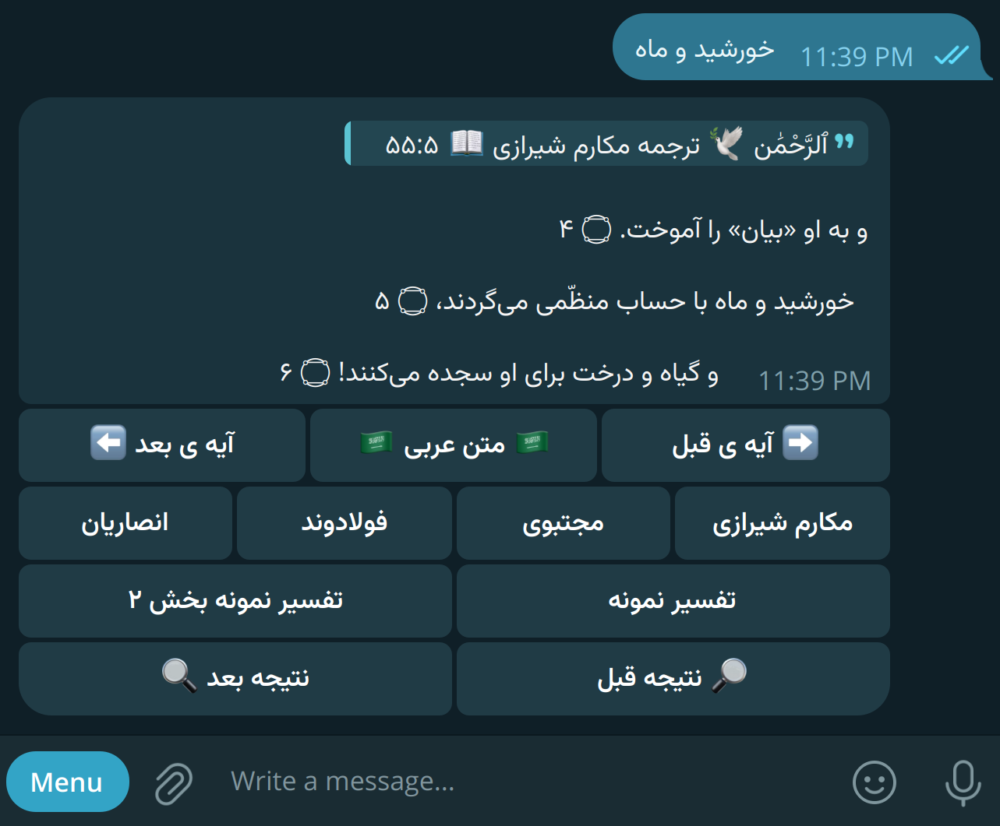

# تبیان قرآن 📖

ربات تلگرامی هوشمند برای دسترسی آسان و سریع به آیات قرآن کریم، ترجمه‌ها، و تفاسیر. 🕊️

می‌تونید کلمه، عبارت، یا شماره سوره و آیه را جستجو کنید و به گنجینه‌ای از معارف قرآنی دست برسید.

**همین حالا استفاده کن:**

* **لینک ربات:** <https://t.me/TebianeBot> 🔗
* **نام کاربری تلگرام:** @TebianeBot 🤖



## ✨ ویژگی‌های کلیدی ✨

* **🔍 جستجوی هوشمند و سریع:**
  * جستجوی "فازی" (Fuzzy Search) که به شما امکان می‌دهد حتی با تایپ تقریبی کلمات، آیات مرتبط را پیدا کنید.
  * جستجو بر اساس کلمه کلیدی، بخشی از آیه، شماره سوره و آیه (مثلا `بقره ۲` یا `2:2`).
* **📜 نمایش متن آیات:**
  * نمایش متن عربی آیات با اعراب کامل
* **🇮🇷 ترجمه‌های فارسی متعدد:**
  * ترجمه استاد حسین **انصاریان**.
  * ترجمه دکتر محمد مهدی **فولادوند**.
  * ترجمه سید جلال الدین **مجتبوی**.
  * ترجمه آیت‌الله ناصر **مکارم شیرازی**.
* **📚 تفاسیر:**
  * دسترسی به **تفسیر نمونه** (آیت‌الله مکارم شیرازی).
  * مشاهده **فیش‌های مرتبط با آیات** از پایگاه اطلاع‌رسانی دفتر آیت‌الله **خامنه‌ای**.
  * نمایش **شأن نزول** آیات از سایت اهل‌البیت.
* **🧭 ناوبری آسان:**
  * حرکت به آیه **بعدی** (➡️) و **قبلی** (⬅️) در همان سوره.
  * پیمایش بین **نتایج جستجو** (🔍 نتیجه بعد / 🔎 نتیجه قبل).
* **🖱️ تعامل کاربرپسند:**
  * استفاده از **دکمه‌های شیشه‌ای (Inline Buttons)** برای دسترسی سریع به ترجمه‌ها، تفاسیر و گزینه‌های دیگر.
  * **صفحه‌بندی** خودکار برای نمایش تفاسیر طولانی در چند بخش مجزا.
* **📌 شخصی‌سازی:**
  * قابلیت **علامت‌گذاری به عنوان خوانده شده ✅** برای بخش‌های تفسیر نمونه و فیش‌های رهبری مربوط به هر آیه.
* **ℹ️ نمایش منابع:**
  * دستور `/resources` برای مشاهده لیست منابع استفاده شده در ربات.

## 🛠️ نصب و راه‌اندازی محلی 🛠️

اگر می‌خواهید این ربات را به صورت شخصی اجرا کنید یا در توسعه آن مشارکت کنید مراحل زیر را دنبال کنید:

### پیش‌نیازها

* **Node.js:** نسخه 20 یا بالاتر ([دانلود Node.js](https://nodejs.org/)).
* **npm** (معمولاً همراه Node.js نصب می‌شود).
* **Telegram Bot Token:** از طریق [BotFather](https://t.me/BotFather) در تلگرام دریافت کنید.

### کلون و نصب وابستگی‌ها

مخزن پروژه را کلون و وابستگی‌ها را نصب کنید:

```bash
git clone https://github.com/mlibre/Tebiane  # یا آدرس مخزن اصلی شما
cd Tebiane
npm install
```

### پیکربندی محیط

یک فایل .env در ریشه پروژه ایجاد کنید (می‌توانید از فایل .env.example اگر وجود دارد، کپی بگیرید). سپس مقادیر زیر را در آن قرار دهید:

```bash
mv .env.example .env

TELEGRAM_BOT_TOKEN=123456:ABC-DEF1234ghIkl-zyx57W2v1u123ew11
STORAGE_PATH=./storage
# (اختیاری) اگر از پروکسی برای اتصال به تلگرام استفاده می‌کنید
# PROXY=<http://127.0.0.1:2081>
```

### اجرای پروژه

برای اجرای ربات

```bash
npm start

# یا

node src/main.js
```
