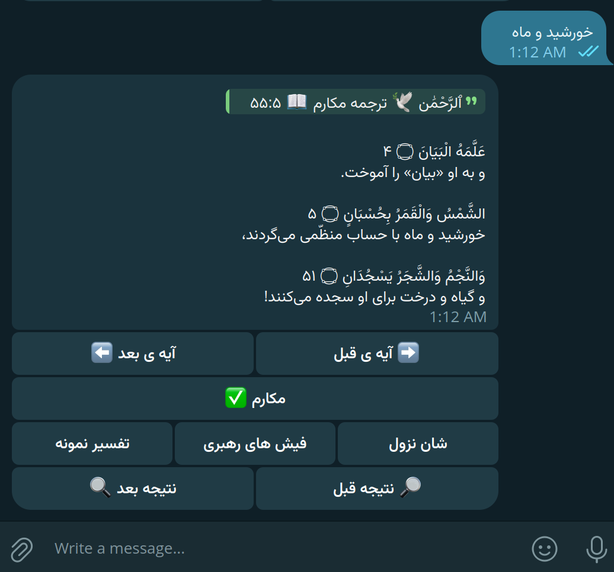

# تبیان قران

یک ربات تلگرام برای جستجوی آیات قرآن کریم به همراه تعدادی از ترجمه ها و تفسیر های فارسی. شما می‌توانید کلمه، جمله یا شماره ی آیه و سوره ی مورد نظر رو جستجو کنید و نتایج مرتبط رو ببینید.

این برنامه در حال حاضر فقط به شکل ربات تلگرام در دسترس قرار داره. برای شروع به یکی از آدرس های زیر برین

* Link: <https://t.me/TebianeBot>
* Telegram Username: @TebianeBot



## ویژگی‌ها

* جستجوی آسان (فازی) در آیات - به این معنی که لازم نیست کلمات به ظور دقیق یا کامل وارد بشن
* نمایش ترجمه‌های مختلف - شامل ترجمه ی اقای مکارم شیرازی، فولادوند و ...ا
* نمایش تفسیر آیات
* گردش بین آیات و نتایج جستجو

## نصب و راه‌اندازی

اگه میخواید این ربات رو به صورت شخصی استفاده کنین یا تغییری روش بدین مراحل زیر رو دنبال کنین

### پیش‌نیازها

برای اجرای این پروژه به موارد زیر نیاز دارید:

* Node.js (نسخه 18 یا بالاتر)
* ربات تلگرام و توکن دسترسی
* [rdrview](https://github.com/eafer/rdrview)

### کلن و اجرا

نصب `rdrview`:

```bash
sudo apt install libxml2-dev libseccomp-dev libcurl4-gnutls-dev lynx
git clone https://github.com/eafer/rdrview.git
cd rdrview
make
sudo make install
```

مخزن را کلن کنید و پکیج های مربوط رو نصب کنید:

```bash
git clone https://github.com/mlibre/Tebiane
cd Tebiane
npm install
```

### پیکربندی تنظیمات ربات

فایل `.env.example` رو به نام `.env` تغییر دهید:

```bash
mv .env.example .env
```

برنامه هنگام شروع شدن این فایل رو میخونه و توکن ربات شما و تنظیمات پروکسی رو برای اجرای ربات استفاده میکنه. نمونه محتویات این فایل به این شکله:

```env
TELEGRAM_BOT_TOKEN=توکن-ربات-شما
PROXY=http://127.0.0.1:2081
```

### اجرای پروژه

برای اجرای پروژه، دستور زیر را وارد کنید:

```bash
npm start

# یا به صورت مستقیم فایل اصلی رو اجرا کنید
node src/main.js
```
